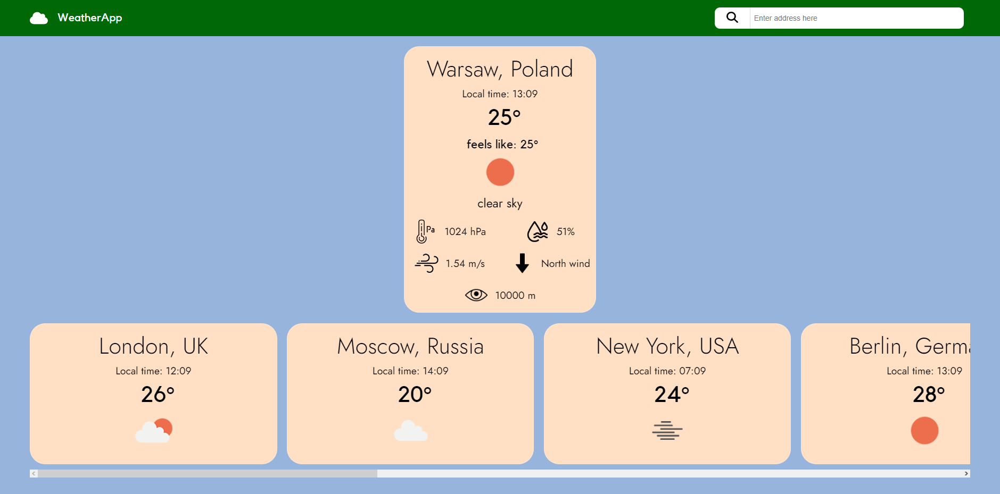

# WeatherApp
> Application used to check for weather in places around the world
# Table of contents
* [Basic information](#basic-information)
* [Functionality](#functionality)
* [Technology Used](#technology-used)
* [Screenschots](#screenschots)
* [Status](#status)
* [Contact](#contact)
* [License](#license)

## Basic Information
The application is hosted on Redner. You can see it [here](https://weatherapp-97de.onrender.com)

## Functionality
App allows for checking for weather information in places around the world. The main point of this appplication was to check the usage of some APIs with free model.
The weather information is sourced from [OpenWeather](https://openweathermap.org) The app uses Geolocation API to find user's location. For the places autocomplete in the
input ment to search a location by typing one im using [Geoapify](https://www.geoapify.com). To display selected location's forecast i also use the reverse geocoding from
[OpenCageData](https://opencagedata.com). The OpenCageData could be ommited in favor of doing it with already present geoapify api but due to the fact that i'm using free plans
its better to diversify in order to increase the ammount of free calls that can be made.
 
 
The application allows for viewing of:
* Local time
* Temperature and what it feels like
* Current weather with text and image representation
* Atmospheric pressure
* Humidity
* Wind speed
* Wind direction
* Visibility capped at 10000m
* 5 Day / 3 Hour Forecast with temperature and weather icon

## Technology used
* Javascript-React, SCSS
* Vite

## Screenschots
### Main view

### Location forecast

### Location search autocomplete

## Status
Project is: __finished__

## Contact
Created by [@Jan Szewczyński](https://github.com/lulek1410).
Feel free to contact me!

## License
Free to use based on the MIT license.
